


 

<!-- ============================ 01 · SNAPSHOT ============================ -->


 

<!-- ============================ 02 · EXPERTISE → EVIDENCE ============================ -->


 

<!-- ============================ 03 · SELECTED WORK ============================ -->


<a href="https://github.com/intelliboyy/VAMAN"></a>


 

<!-- ============================ 04 · TRACK RECORD ============================ -->


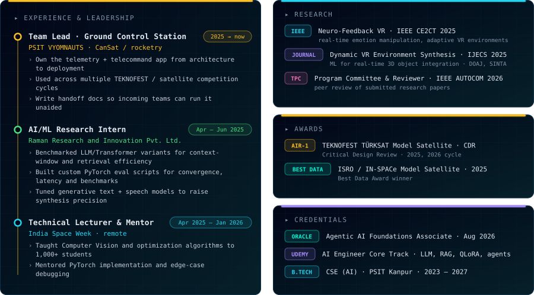

<b>📚 Full publication titles</b>

 

1. **Neuro-Feedback VR: Real-Time Emotion Manipulation and Adaptive Environments for Enhanced Performance and Therapy.** IEEE CE2CT, 2025. [IEEE Xplore](https://ieeexplore.ieee.org/document/10939880)
2. **Dynamic Virtual Environment Synthesis: Leveraging Machine Learning for Real-Time 3D Object Integration in VR Spaces.** International Journal of Electronics & Communication Systems, 2025. Indexed in DOAJ and SINTA.
3. **Technical Program Committee Member & Peer Reviewer**, IEEE AUTOCOM 2026.

 

<!-- ============================ 05 · LIVE & CONTACT ============================ -->

<picture>
  <source media="(prefers-color-scheme: dark)" srcset="https://raw.githubusercontent.com/intelliboyy/intelliboyy/output/github-contribution-grid-snake-dark.svg">
  <source media="(prefers-color-scheme: light)" srcset="https://raw.githubusercontent.com/intelliboyy/intelliboyy/output/github-contribution-grid-snake.svg">
  
</picture>

**Recent activity**

<!--START_SECTION:activity-->
<!--END_SECTION:activity-->


